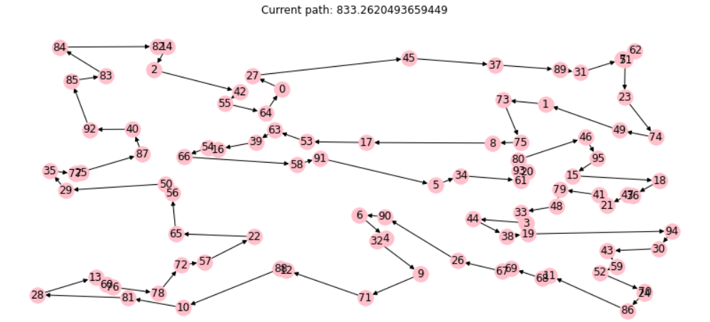
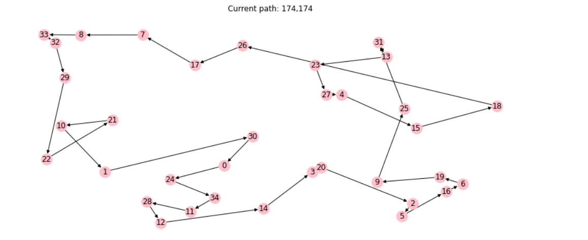

# Introduction
This project has been developed exclusively by Francesco Blangiardi (s288265) as the final assignment of the GPU programming course. The project is aimed at making use of a GPU to solve a problem or a task while exploiting the techniques taught during the course. The task selected by the project owner is the development of a solution for the Travelling Salesman Problem (TSP) through a genetic algorithm, which is a population algorithm that can exploit the high level of parallelism offered by GPUs. The task was deemed interesting for the project owner since it would lead to a great speed up with respect to a sequential approach. 

The challange of this project comes from the fact that the instruction flow of genetic algorithms heavily depends on randomness and on the data, which can lead to very poor performances if implemented naively.
Moreover, some alternative versions of the program are also proposed that differ in the usage of memory, as suggested by the professors. 

The whole project, with the exception of the scripts used to start the program, has been developed in Cuda language. All experiments and assessments were run on a Jetson Nano NVIDIA developer kit.

# A summary of Genetic Algorithms

## An overview
In computer science and operations research, a genetic algorithm (GA) is a metaheuristic inspired by the process of natural selection that belongs to the larger class of evolutionary algorithms (EA). The goal is generally the optimization of a given problem by applying a set of biologically inspired operators to a set of candidate solutions. The algorithm is usually applied either for a set amount of iterations or until the algorithm is no longer capable of improving the currently provided solution.

It's worth observing some (simplified) terminology before exploring the topic further:

- Population. This is the set of candidate solutions that are used by the algorithm. The population generally has a fixed size and its content changes between iterations, where each of them is supposed to improve its general quality (in terms of "fitness" of each solution). A correspondence with natural selection can be found: the population represents a whole species, and each solution represents a single organism; as time passes, the organisms reproduce and the whole species evolves in order to thrive in the environment.

- Individual. An individual is a single eligible solution for the given problem. The term can be used both for solutions belonging to the population and for solutions that are not present within the population but that can suitably solve the problem (regardless of their quality). More specifically, we will use this term to indicate the encoding of a given solution (in our case, an Hamiltonian Cycle for a set of N nodes is the solution, while its encoding can be seen as a permutation of N numbers representing each node)

- Offspring. It is an intermediate population within iterations. It generally has a higher size than the main population and it's generated from it through the use of genetic operators (crossover and mutation). At the end of each iteration, the offspring undergoes the process of selection where only a given set of individuals survives, thus creating what will be the main population for the next iteration.

- Genome. It represents the set of features that compose an individual (i.e. the position of each node within the permutation). Moreover we refer to a single feature (i.e. node 1 in position 3) as "Allele". Finally we name the components of the genome that can host an allele (i.e. position 3 in the permutation) as "Loci". The obvious correlation with biology is the DNA for actual organisms, where the combination of each allele defines the actual phenotype of the individual. 

- Fitness. This term is not exlusive to GA approaches and, as in the general case, it represents how "good" or "close to the optimum" an individual is at solving our given problem. This is generally represented as a function that depends on the genome of the individual and it is meant to influence the selection process at each iteration according to some criterion. Once again we can find a correlation with natural selection, where the fitness can be seen as the strength and/or the adaptability of the organism and the likelihood that it will pass its genome (or parts of it) to the next generations.

With these premises, we can define the typical flow of a genetic algorithm:
1. The main population is initialized (randomly most of the times)
2. The offspring is generated from the main population according to the developed genetic operators (this process generally involves a farir amount of randomness)
3. The selection process is applied to the offspring taking into account the fitness of each individual
4. Step 2 and 3 are repeated until some stopping criterion is met (convergence of the best individual or reaching a certain amount of iterations)
5. The all time most fit individual is provided as the final solution for the problem

## Genetic operators

These operators are the core of the GA and allow the algorithm to perform each of its step. They can be divided into three cathegories based on their input and their functionality:

- Mutation. They are used in the offspring generation step and take only one individual as input. They are generally a random change to the genome of the input individual.
- Recombination. Just like mutation they are meant to generate an offspring, with the difference that they take two or more individuals as input. Usually they also involve a certain degree of randomness, but the output individual is supposed to have a genome that was reconstructed to a certain extent from all its parent individuals.
- Selection. As the name suggests this operator is responsible for selecting the surviving individuals among the offspring at each iteration. It can be seen as an operator that takes as input the whole offspring and outputs the main population of the next iteration

## Drawbacks and issues
The major strength of this approach is that it's applicable to virtually any problem where the solution can be encoded into an array-like structure. However, GA also are an heuristic that rely heavily on randomness (both in the generation step and potentially also in the selection step), so ad-hoc algorithms optimized to solve the specific problem at hand would generally perform better than GAs. For such reason, the aim of the project is not necessarily to find the optimal solution for TSP but rather to implement a GA that can arrive at a reasonably good solution in a reasonably small time.

Furthermore GAs also have some issues that are intrinsic to the procedure. A good GA should always balance exploitation and exploration (i.e. continue to iterate nearby the currently found local optima vs looking for solutions that are distant from the current local optima, in the hope to find a new and better local optima). This translates into maintaining a certain level of "genetic diversity" among the main population: if the algorithm neglects keeping diversity, the population will quickly converge to the same solution and the GA will be stuck into a local optima; on the other hand, neglecting the survival and abundance of good genetic features may make the algorithm's convergence too slow.

This problem is particularly relevant when the population size is small, but in our case the size of the population doesn't represent a major constraint for our architecture, which means that we will overcome these issues by increasing the population size.

# Implementation

## Overview
The algorithm will implement the pipeline explained in section 2.1. The host device will only take care of allocating the memory, generate the graph, managing the kernels and collecting statistics while population initialization, offspring generation, selection as well as other support functions will be performed by the GPU. To simplify some operations, the curand and thrust libraries were used.

The graph is represented as an NxN adjacency matrix where N is the number of nodes (or cities) of our TSP graph, where each node is represented by a number from 0 to N-1. 

As explained above, the solutions for the TSP are Hamiltonian Cycles between every node of the graph, and they will be encoded into a N dimensional array representing a permutation of N-1 numbers.

## The genetic operators

For the main application a total of 4 genetic operators were developed: swap mutation, inversion mutation, cycle crossover and a simple selection.

### Swap Mutation

This simple operator takes one individual as input, and selects two loci randomly: the content of the two loci is swapped. Altough it's a small change, it's worth noting that this mutation can lead to large differences in terms of fitness between parent and offspring individuals, as in our case it changes 4 links in the hamiltonian path.

### Inversion mutation

The inversion mutation also takes as input a single individual and selects once again 2 loci in a random way: the order of the alleles between these two loci is inverted. This mutation is slightly more complex than the swap, but actually it changes only 2 links in the path (the ones linking the two selected loci with the external ones)

### Cycle crossover
This is the only recombination operator implemented and it's also the most complex among the generation operators. First, two parents are selected within the population, which we will call "partent 1" and "parent 2". Once again 2 loci are selected:

1. The genoma between the two loci is copied into the offspring from parent 1
2. The rest of the missing loci are reconstructed from parent 2 (the links coming it are not necessarily kept intact)

 

Cycle crossover can change a large amount of links in the path, however most of them will be reconstructed from solutions belonging to the population, which means that they have high chances to be good links (as opposed to links generated purely from randomness). It is also worth noting that the instruction flow depends both on randomness (the loci selected) and on the data (the reconstruction of the genome from parent 2 requires checks and conditional assignments), which is what makes this genetic operator the most tricky to be implemented efficiently.
 
### Selection operator
The selection operator chosen is rather simple: the fitness for each offspring is evaluated, and only the best individuals are copied back into the population array, ready for undergoing the next iteration. This normally is not a good selection operator since it generally makes the population converge to the same solution rather quickly. However as we will see from the results this is a good enough operator since we are allowed to keep a much larger population compared to the sequential case which, when the graph is sufficiently large, allows the GA to keep a decent amount of diverse genetic features within the population for a reasonable amount of iterations.

## Code implementation

In the following the code implementation is described in detail. We refer to the number of nodes of the graph as N, the dimension of the main population as P (in number of individuals), and the size of the offspring as O. Additionally we define the (integer) ratio O/P as OF (offspring factor)
### The pipeline

The pipeline of the algorithm is described in detail as follows:

1. Population Initialization. After the host has initialized the graph and allocated all the required memory, it initializes a curand generator which generates an amount of random numbers equal to N*P directly into device memory. Then, the host calls the kernel "init_pop_s" (kernels/kernels.cu), where each thread takes care of initializing one individual: first the sequence of numbers from 0 to N-1 is written on the corresponding memory location; then, each thread shuffles the sequence through a sort operation according to the randomly generated numbers. This kernel is only used once per application and it doesn't represent a bottle neck, therefore a somewhat simple implementation was kept for the final project.
2. Genetic random numbers generation. This is the first operation that is performed inside the main loop and therefore it's the first operation of every iteration. Since the instruction flow of the generation step depends heavily on these random numbers, it's important to take precautions in order to keep the warp divergence of the generation step as low as possible. In this project, this was achieved by generating a number of random numbers equal to OF*3 for each warp launched by the generation kernel: in this way all the threads belonging to the same warp will use the same set of random numbers (3 are the amount required by each genetic operator) for every individual generated. This means that threads belonging to the same warp will select the same loci (different for every offspring individual) regardless of the genetic operator performed, which is what dictates the instruction flow for the most part.
3. Generation Step. This is the core of the application and it is performed by the kernel "naive_generation" (kernels/generation_kernels.cu). It takes as input the main population (treated as a read-only array), the offspring and the random numbers generated on step 2 and launches a thread per each individual in the population. Each thread will be responsible to generate a number of offspring individuals equal to OF with their assigned population individual as the main parent:
    * First comes the copy step: the main parent is copied in the offspring array in each of the positions occupied by the future offspring of the main parent
    * Then each thread will be divided based on the warp nuber it belongs to, each category determining the genetic operator the warp will perform
    * Finally, the thread will run a loop that performs the assigned genetic operator on each of the OF offspring copies by using the random numbers assigned to its warp (each iteration of this loop will use a different set of 3 random numbers) and optionally using the input main population as a read-only array for the recombination operator. This leads to the offspring array containing the whole offspring of the current iteration and being ready for the selection step.
    Moreover the warps undergoing the recombination operator will use a different parent 2 for each of their threads (using the same parent 2 for the whole warp is not healthy for the algorithm altough it could be beneficial for time performances) and the implementation of the operator was done in such a way that, despite the instruction flow depends on each parent 1 and parent 2, the warp divergence for the whole generation kernel is equal to 0 at the expense of some no-op load/stores (the implementation of the operators can be checked at device_utils/genetic_ops.cu, a detailed log can be found in logs/large/naive_versoin_logs/n.log).

4. Selection Step. As stated before, this step just copies the top P offspring individuals back into the main population array. This is done through several sub steps that are wrapped by the host function "naive_selection" (kernels/selection_kernels.cu):
    * First, the whole offspring is evaluated by launching the evaluate_kernel. It takes as input the offspring array, the TSP graph, a vector that will store the fitness of each individual and an auxiliary vector of dimension O (it will be useful for the next step). The kernel launches a thread for each individual where each of them will evaluate its fitness and store it in the fitness array. Moreover the thread initializes the auxiliary array by storing its tid (or rather, the position of the assigned individual) to the corresponding position of the array.
    * At this point the auxiliary vector is a vector such that the value inside each element represents the position of a given individual inside the offspring vector, while the element of the fitness vector located at the same position as the auxiliary element stores the fitness of said individual. The next step of the selection is sorting the auxiliary vector by using the values of the fitness as keys, which is easily done through the Thrust library (method thrust::sort_by_key)
    * Finally, the kernel "swap_with_positions" (kernels/kernels.cu) is launched with P threads. Each thread simply looks at the element of the auxiliary vector corresponding to its tid and copies the individual stored in the offspring vector at the found position into the main population vector. The kernel also reinitializes the auxiliary vector as in the evaluation kernel.

5. Shuffle. Now that the next generation is ready for the next iteration, statistics are collected (using a simple kernel swap_best, in kernels/kernels.cu) and finally the whole population is shuffled. This is to avoid that the operators applied to the next generation have no correlation to the fitness of the individual (if we didn't apply a shuffle the top 32 individual would always undergo swap, the top 32-64 would always perform inversion etc.). The implementation is described as follows:
    * As a first step, P random numbers are generated, one for each individual in the main population
    * The sorted population is copied into a second vector. This is done through a CudaMemcpy device to device and by reusing the offspring vector (which no longer holds relevant informations)
    * The device version of thrust::sort_by_key is used once again, the vector to be sorted is the same auxiliary vector of the selection step while the P random numbers are our keys.
    * swap_with_positions is called once again, which effectively shuffles our population.

6. Once a set amount of iterations are performed, the program exits the main loop, displays the solution along with some statistics and finally frees the memory

## Alternative versions
As suggested by the professor, some alternative versions were also developed. Two additional versions were proposed:

* Constant graph version. The TSP graph is read several times by all threads during the evaluation kernel, so a version of the application where the graph is stored in the constant memory was developed. As we will see in the results section, this led to an improvement in performance when the graph was small, but eventually with graphs with higher dimension it didn't improve over the baseline program
* Shared memory version. Since the kernel that takes the most computational time is the generation kernel, a version that uses shared memory in that kernel was developed. In retrospect, this application is not the best fit for using shared memory: the whole population definitely cannot fit in the shared memory; the kernel overall does not perform a very high amount of load and stores (aside from the recombination operator) other than the first copy of the main parents into the offspring vector; also, even storing just the relevant fraction of the offspring in the shared memory is not possible when the size of the graph increases, the only alternative being reducing drastically the amount of threads per block. In any case a version where each block stores in shared memory the part of the offspring assigned to it was developed. In detail, during the copy step each thread copies the main parent in the first offspring position and then copies the remaining offspring positions from the shared memory itself. Since in the end the shared vector has to be copied in the global offspring vector, this leads to a gain of (OF-1)*N reads, which are shared reads instead of global reads. The recombination kernels also perform some reads that benefits from the shared memory usage. Also, this version uses the constant graph evaluation kernel
* Island version. This is a variant of the Shared memory version. The idea is that the individuals can perform recombination only using individuals from the same block as secondary parent, and the same goes for the selection step where only the top individual within the block survive and are copied in the main population vector. This version was developed just in case the baseline GA was not able to maintain enough diversity withing the population, but ended up performing worse both in terms of time performance and of actual solution found.

# Results
The experiments were run on several configurations. The time performance was measured both using the nvprof profiler and events.

Disclaimer: since the instruction flow depens on randomness, there's a considerable fluctuation in terms of execution time whenever the application is run.

Heres a summary of the configurations used and the name that will be used to refer to them (all experiments were run with a population size of 1024 individuals and for 500 iterations, each configuration has a dedicated log folder) :

| name      | Graph dimension (in nodes) | Offspring factor | threads per block (non shared) | threads per block (shared) |
| ----------| -------------------------- | ---------------- | ------------------------------ | -------------------------- |
| small     | 16                         | 4                | 128                            | 64                         |
| medium    | 32                         | 4                | 128                            | 64                         |
| large     | 48                         | 4 (2 for shared) | 128                            | 64                         |
| xl        | 96                         | 4                | 128                            | not performed              |

## Time performances
In the following are shown the time performances of each version measured through events. The result reported is in milliseconds and represents the average time for performing a whole iteration:

| name      | baseline version           | constant graph   | shared version                 | island version             |
| ----------| -------------------------- | ---------------- | ------------------------------ | -------------------------- |
| small     | 2.09                       | 1.63             | 1.65                           | x                          |
| medium    | 3.00                       | 2.69             | 2.79                           | x                          |
| large     | 4.23                       | 4.03             | 2.89  (reminder: lower OF)     | 3.40                       |
| xl        | 10.05                      | 10.88            | x                              | x                          |

Additionally, here's some comparisons for the various steps between the various versions, in order to better understand the impact of our different versions (in ms as reported by nvcc):

| step/configuration | baseline version           | constant graph   | shared version                 | 
| -------------------| -------------------------- | ---------------- | ------------------------------ | 
| generation/small   | 413.44                     | 362.18           | 337.40                         | 
| selection/medium   | 141.3                      | 114.24           | 109.1                          | 
| selection/xl       | 436.41                     | 549.60           | x                              | 

## Optimality performance 
All the models performed nearly in the same way in terms of quality of the solution found (except for the island version). In the following is shown a table comparing the length of the path found by the GA versus a third party solver (Beware: some approximations were applied for the graph of the third party solution, it may be that GA would perform slightly better than the third party algorithm sometimes). The comparison can be checked [Here](https://colab.research.google.com/drive/1EYaF1PwMCuz9yRErvk1h2SPhb2NipQgq#scrollTo=pAulKmTal2es)

| name      | GA solution                | third party solution | 
| ----------| -------------------------- | ---------------- | 
| small     | 387.07                     | 387.90           | 
| medium    | 511.27                     | 521.73           | 
| large     | 583.23                     | 607.53           |
| xl        | 833.26                     | 806.56           |

For clarity, also some pictures of the generated paths are reported (they can be checked [Here](https://colab.research.google.com/drive/1EYaF1PwMCuz9yRErvk1h2SPhb2NipQgq#scrollTo=pAulKmTal2es)):

* GA solution for the medium graph

* GA solution for the large graph

* GA solution for the extra large graph

# Conclusions
To get an idea of the quality of the proposed solution it may be worth taking a look at a sequential version.

[Here](https://colab.research.google.com/drive/1wXcoppMPPXXV-xNYpael242_TRqEZZpI) a sequential solution developed in python can be found. The algorithm operates on a graph of 35 nodes and iterates until convergence, however the time performances don't allow to perform computations in a reasonable time with the same population configuration as the GPU version. The population size was reduced to 50 individuals and the offspring factor was kept at 4: the sequential version takes nearly one minute to run and, despite the graph being rather small in size, the drastic decrease in population size leads to a final solution that presents some clearly sub optimal parts.

* GA solution for a TSP graph of 35 nodes. The top right side of the graph presents a sequence of links that are clearly not optimal

Therefore, the baseline version definitely presents a very high improvement with respect to the sequential problem. As we could see from the results, it is able to find the optimal path for graphs of up to 48 nodes, and managed to give a solution very close to the optimal one even for a graph of 96 nodes (reminder: this means a search space with a number of candidate solutions that has roughly 147 digits!).

As for the time performances of the alternative solutions, an overall improvement was found in the areas that were supposed to receive a speed up (altough only when the graph is small). There are some comments to be made however:

* Constant graph version. The evaluation kernel outperforms the one of the baseline when the graph is not too large, however it falls off in the xl configuration. This happens because constant memory is not well suited for parallel reads of different areas of the memory: as the graph size increases, the probability that more threads perform a read on the same region of the graph grows dimmer, which leads to the baseline version being better in this case despite constant memory being much faster than the global one.
* Shared memory version. Shared memory is at a disadvantage with respect to the the other two main versions: in order to fit all the needed data into the shared memory, the number of threads per block had to be reduced. This is perhaps what led to this version not being able to outperform the constant graph version. As a final consideration, it's probably not worth using this version over the other two considering the amount of constraints it applies to the application parameters.
* Island version. This version was developed in case the main versions failed to perform well on the task. It was meant to keep more diversity within the population while exploiting better the shared memory, but since it did not reach good performances within 500 iterations this version was discarded

# Possible improvements
There are several improvements that can be brought to the project in many different parts.

If we want to focus on improvements of the main bottlenecks, a few come quickly to mind:

* Use more threads in the generation step. Instead of using one thread per main population individual, it could have been a better idea to launch one thread per offspring individual. This would have lead to a further decrease in speed up for the shared version, but it probably would have made for a higher degree of parallelism for the two other main versions (since the threads no longer need to iterate over the children).
* More threads in swap_with_positions. As the graph increases, the computational time for this kernel becomes more noticeable. Just like for the generation step, it probably would have been a better idea to launch a thread for each allele of each individual instead of just launching one per individual.
* Splitting the generation kernel. Probably splitting the generation kernel into three parts (one per genetic operator) and launching each of them on a different stream could have brought to a slight improvement.
* Rethinking the graph representation. The graph was represented as an NxN adjacency matrix, which means that the data related to each link is duplicated. Halving the size of the graph so that there's no duplicated data not only would improve the memory usage, but it would also improve the performance of the constant graph version since the probability that more threads would read from the same position would double (i.e. better parallelism for constant reads).
* Further research on the used libraries. The thrust and curand libraries perform many relevant operation, but not too much time was spent on researching the optimal way to use them.

It's worth mentioning that the implementation of a tiled version was contemplated but due to the fact that some operations present some intrinsic sequential operations (cycle crossover) and that the individuals occupy rather large chunks of memory the idea was discarded.

# Usage and code structure
The code is structured within several folders:

* kernels. This folder contains all the kernels used by the application as well as some wrapper host functions that contain them. Kernels are divided into generation kernels (generation_kernels.cu), selection kernels (selection_kernels.cu) and utility kernels (kernels.cu)
* device_utils. Here are stored some of the device functions used by the kernels. The implementation of the genetic operators can be found in genetic_ops.cu, while the evaluation function can be found in device_utils.cu
* logs. This folder stores all the logs generated from the experiments shown in section "Results".
* main. This is where the main files of each version are stored as well as some othe program meant to test the other files (island version can be run by changing the appropriate parameters in main.h and running the shared version)
* utils. Here can be found several utility host functions, mainly dedicated to the TSP graph allocation and initialization.
* scripts. A folder containing several scripts to run the application

To manage the application parameters, refer to the file main/main.h. It contains several parameters for the graph (N_NODES) as well as some that affect the instruction flow. Be aware that having too many threads per block in conjunction with a large graph and offspring prevents the application from compiling due to the static shared memory version: to run the application in these cases, set the COMPILE_SHARED parameter to 0.

To launch the application, refer to the scripts present in the folder "scripts". Through them it is possible to compile the program and run it either normally or with some nvprof options. Typical usage is "script.sh name_of_the_version folder_where_to_store_the_logs"
